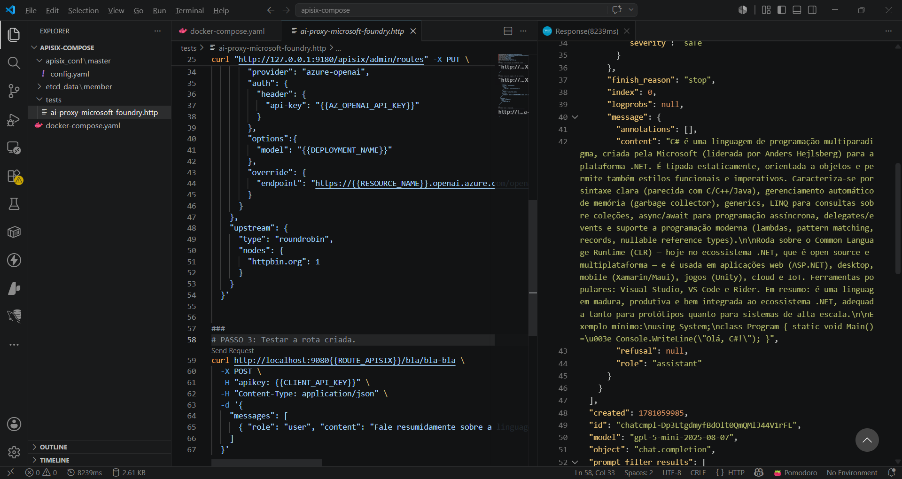
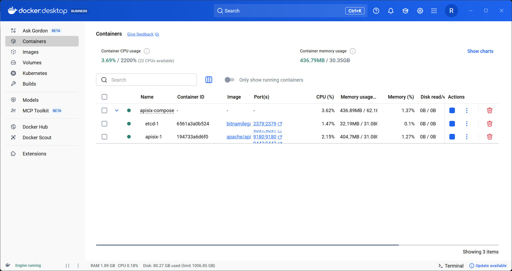
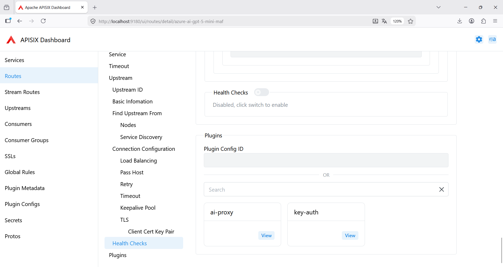

# apisix-ai-gateway-dockercompose
Scripts do Docker Compose para subida de um ambiente do APISIX com capacidade de AI Gateway.

Testes utilizando os plugins [**ai-proxy**](https://apisix.apache.org/docs/apisix/next/plugins/ai-proxy/) e [**key-auth**](https://apisix.apache.org/docs/apisix/plugins/key-auth/), com um recurso do **Microsoft Foundry** - via extensão [**REST Client**](https://marketplace.visualstudio.com/items?itemName=humao.rest-client):

Containers criados (**APISIX + etcd**):

Rota configurada no APISIX:

